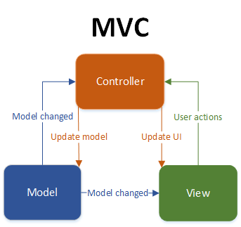
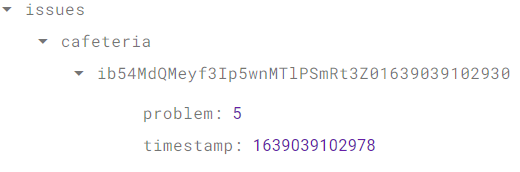

# Software Architecture Document (SAD)

# Table of Contents
- [Introduction](#1-introduction)
    - [Purpose](#11-purpose)
    - [Scope](#12-scope)
    - [Definitions, Acronyms and Abbreviations](#13-definitions-acronyms-and-abbreviations)
    - [References](#14-references)
    - [Overview](#15-overview)
- [Architectural Representation](#2-architectural-representation)
- [Architectural Goals and Constraints](#3-architectural-goals-and-constraints)
- [Use-Case View](#4-use-case-view)
    - [Use-Case Realizations](#41-use-case-realizations)
- [Logical View](#5-logical-view)
    - [Overview](#51-overview)
    - [Architecturally Significant Design Packages](#52-architecturally-significant-design-packages)
- [Process View](#6-process-view)
- [Deployment View](#7-deployment-view)
- [Implementation View](#8-implementation-view)
    - [Overview](#81-overview)
    - [Layers](#82-layers)
- [Data View](#9-data-view)
- [Size and Performance](#10-size-and-performance)
- [Quality](#11-quality)

## 1. Introduction

### 1.1 Purpose
This document provides an overview of our software architecture. With several different architectural views it depicts different aspects of the system. It is intended to capture and convey the significant architectural decisions which have been made for the system.

### 1.2 Scope
This document describes the architecture of the DHBWorld project.

### 1.3 Definitions, Acronyms and Abbreviations

| Abbrevation | Description                            |
| ----------- | -------------------------------------- |
| MVC         | Model view controller                  |
| SRS         | Software requirements specification    |
| UC          | Use case                               |
| n/a         | not applicable                         |

### 1.4 References

| Title                                                              		| Date       | Publishing organization   |
| --------------------------------------------------------------------------|:----------:| ------------------------- |
| [DHBWorld Blog](https://dhbworldka.wordpress.com/)   		                | 2021-12-09 | DHBWorld Team     |
| [Repository on GitHub](https://github.com/inFumumVerti/DHBWorld)		    | 2021-12-09 | DHBWorld Team     |
| [UC1 Mealplan](./Use%20Cases/uc_mealplan.svg)           		            | 2021-12-09 | DHBWorld Team     |
| [UC2 Personal Information](./Use%20Cases/uc_personalinformation.svg)      | 2021-12-09 | DHBWorld Team     |
| [SRS](./README.md)                      		                            | 2021-12-09 | DHBWorld Team     |

### 1.5 Overview
This document contains the architectural representation, goals and constraints as well 
as the logical, deployment, implementation and data views.

## 2. Architectural Representation
This project uses the MVC Pattern for the front end (Android App) but most of the View-components are handled internally with xml files. The MVC Pattern can be seen in the next picture:

## 3. Architectural Goals and Constraints

### MVC
As mentioned in chapter two our App is using the MVC pattern. This enables a clean software architecture with separate model view and controller.

### Front end
The Android App is written in Java. In the Frontend no MVC Tool is needed, because the MVC Pattern is integrated into the Android Framework.

## 4. Use-Case View

* Green: until december
* White: until june
* Yellow: optional
* Gray: updated use cases

More information about functionality of the application and defined Use-Cases of the Project you can find in [SRS](./README.md).

## 5. Logical View

### 5.1 Overview
In our app we tried to combine all the classes which belong together into a different package. This way it is very clear to anyone who wants to edit the code where he/she can find the code he/she is looking for.

### 5.2 Architecturally Significant Design Packages
The following image shows one of our UML diagrams. Categorized in Model, View and Controller
  
As you can see we only marked two classes as "View". As we mentioned in chapter two Android handles most of the "View" part internally and you only have to provide xml files to build the actual views.

## 6. Process View
n/a

## 7. Deployment View

## 8. Implementation View
n/a
### 8.1 Overview
n/a
### 8.2 Layers
n/a

## 9. Data View
Our Database is handled with Firebase. There we don't use the classic ERM but rather a simple JSON structure that you can see in the image below. In the "issue"-object there are three sub-objects: cafeteria, coffee and printer for our three event-reporting-categories. In there we save the reports from the users.

## 10. Size and Performance
n/a

## 11. Quality/Metrics
n/a
